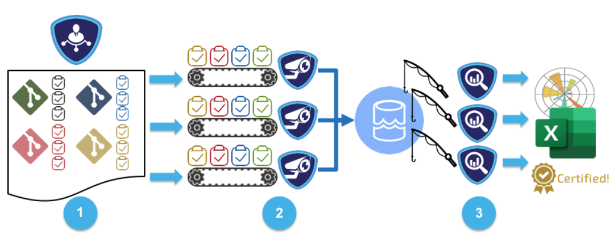

# Reposcanner


[](https://github.com/bssw-psip/reposcanner/actions/workflows/python-package.yml)

Reposcanner provides a highly modular, extensible framework for defining routines for mining data from software repositories and performing analyses on that data to yield valuable insights on team behaviors. Reposcanner provides a number of attractive features not normally seen in repository mining research codes, such as seamless support for different version control platforms like GitHub, Gitlab, and Bitbucket, smart parsing of URLs, intelligent credential management capabilities, and a comprehensive test suite. 




The diagram above illustrates the overall architecture of the Reposcanner toolkit. Data collection operations are represented as task objects which are consumed by mining routines. The resulting data is held in a communal data store which can be leveraged by downstream analyses responsible for graphs, summaries, and other artifacts.

## How to Install

First, clone the repository from GitHub:

```
git clone https://github.com/bssw-psip/reposcanner.git
```

Then install Reposcanner and run the test suite:

```
cd reposcanner
python3 -m venv ../repo-env # create a new virtual environment
. ../repo-env/bin/activate  # activate the new virtual env
pip install -e .            # create editable install
tox                         # run tests
```

If all tests pass, the installation was successful, and you are ready to go!


# How to Run

## Setup input files

We'll run the example scan specified inside `tutorial/inputs` directory.

1. First, add your github token to the `token:` line in `tutorial/inputs/credentials.yml`

2. Run the reposcanner tool using:

```
reposcanner --credentials tutorial/inputs/credentials.yml --config tutorial/inputs/config.yml --repositories tutorial/inputs/repositories.yml --workspaceDirectory tutorial/workspace --outputDirectory tutorial/outputs --notebookOutputPath tutorial/outputs
```

3. examine the output files written to `tutorial/outputs`

# How to extend functionality

In the early days, the only way to extend Reposcanner was to modify its source, but now Reposcanner can be extended externally as well. We recommend the external method for future projects, so we don't create tons of forks of Reposcanner for each new analysis.

1. Create a new source file, `my_module.py` or `my_package/my_module.py`.

2. Import `reposcanner.requests` and one of {`reposcanner.routine` or `reposcanner.analysis`}, depending on if you want to write a routine or an analysis.

3. Locate the most relevant subclass of `reposcanner.requests.BaseRequestModel` and one of {`reposcanner.routines.DataMiningRoutine` or `reposcanner.analyses.DataAnalysis`}. E.g., for a routine that requires GitHub API access, one would subclass `OnlineRoutineRequest` and `OnlineRepositoryRoutine`. Reference the minimal blank example in `reposcanner.dummy` or real-world examples in `reposcanner.contrib`.

4. Write a config file that refers to your routines and analyses. See the next section on configuration files.

5. Check that `my_module` or `my_package.my_module` is importable. E.g., `python -c 'from my_module import MyRoutineOrAnalysis'`.
  - The current working directory is implicitly in the `PYTHONPATH`, so your module or package will be importable if you run Python and Reposcanner from the directory which contains your module or package
  - If your module or package does not reside in the current working directory, you need to add it to your `$PYTHONPATH` for it to be importable: `export PYTHONPATH=/path/to/proj:$PYTHONPATH`. This only has to be done once for your entire shell session. Note that the `$PYTHONPATH` should have the path to the directory containing your module or package, not the path to your module or package itself. E.g., In the previous example, if you have `/path/to/proj/my_module.py` or `/path/to/proj/my_package/my_module.py`, set the `PYTHONPATH` to `/path/to/proj`.

6. Run Reposcanner.

# Input files


## config.yaml

The config file contains a list of routines and a list of analyses. Each routine or analysis is identified as `my_module:ClassName` or `my_module.my_package:ClassName`.

Within each routine, one can put a dictionary of keyword parameters that will get passed to that routine.

```
routines:
  - my_module:NameOfOneRoutine
  - routine: my_module:NameOfAnotherOneRoutine
    arg0: "foo"
    arg1: [1, 2, 3]
analysis:
  - my_module:NameOfOneRoutine
  - my_module:NameOfAnotherOneRoutine
    arg0: "foo"
    arg1: [1, 2, 3]
```
